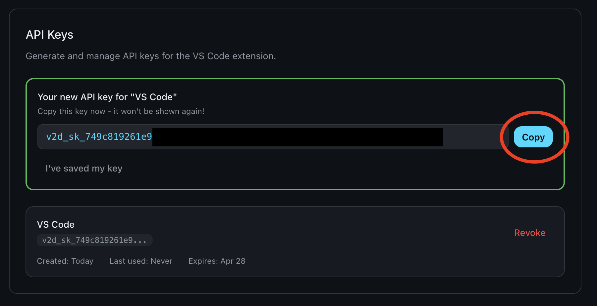
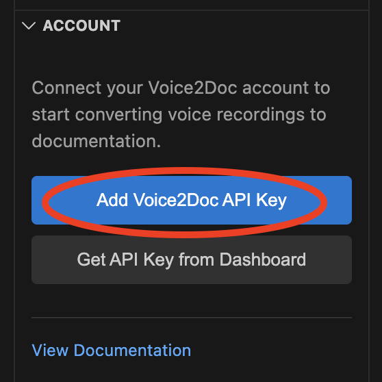
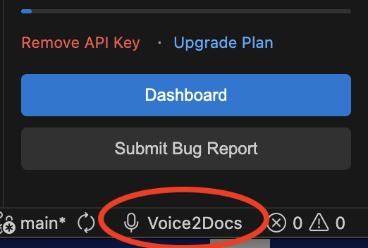
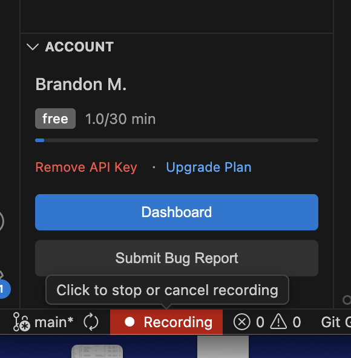
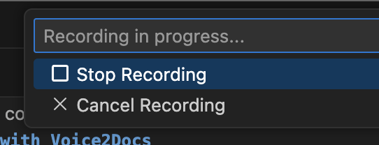

# Voice2Docs - Public Repository

This repository serves as the official repository for bugs, issues, and feature requests.

## Overview
Voice2Docs is a voice-to-documentation tool that allows you to create and update documentation by speaking naturally. The tool transcribes your speech and converts it into properly formatted markdown.

## Install Voice2Docs

To install the tool, you'll need to:

1. Install FFmpeg (if not installed)
2. Register for a Voice2Docs account
3. Install the VSCode Plugin

### Installation of FFmpeg

`ffmpeg` is required to be installed on your system to do any audio recording. It's a widely used
and trusted software. To install, either visit the [ffmpeg downloads page](https://ffmpeg.org/download.html), or install via CLI:

- Mac: `brew install ffmpeg`
- Windows: `winget install ffmpeg`
- Linux: `sudo apt install ffmpeg`

To verify installation, run `ffmpeg -version` in your terminal. You should see something such as `ffmpeg version 8.0.1 Copyright (c) 2000-2025 the FFmpeg developers` with more information below it.

### Creating a Voice2Docs account

To create an account, visit the [Voice2Docs website](https://voice2docs.vercel.app/) and register for an account. You'll receive a confirmation email with the next steps.

### Installing the VS Code Extension

You can install the VSCode extension from the [VSCode Marketplace](https://marketplace.visualstudio.com/items?itemName=Voice2Docs.voice2docs), or by navigating to the extension panel in VSCode, typing in `Voice2Docs` and then clicking "install".

## Using the Plugin

### Authentication

Before you can start working with Voice2Docs, you'll need to set up authentication using an API key:

1. Navigate to the [Voice2Docs website](https://voice2docs.vercel.app) and create an account (or log in if you already have one)

2. Access your dashboard where you will find an "API key" section

3. Click the "Generate" button to create your API key and copy it.

**Note:** Only one key per account is currently supported.

5. Return to the VS Code plugin, click the "Insert API key" button, and insert your API key. You'll see a drop-down at the top of your editor to paste your key.

Once authenticated, you'll be able to access all Voice2Docs features within the VS Code extension.

Note: You do _not_ need to use any API keys from language models (i.e. OpenAI, Anthropic), as Voice2Docs handles this for you. Round of applause for not using your own tokens?

### Using Voice2Docs

The Voice2Docs plugin integrates seamlessly with your VS Code workspace to manage documentation files. Understanding how the plugin interacts with your project structure is essential for effective use.

Pro plan members have the option to toggle "codebase awareness", making Voice2Docs aware of not only
your codebase, but also your documentation. Free members do not have access to this feature.

#### Workspace Integration

The plugin operates by default in your workspace root directory, automatically detecting and processing markdown files within your project structure. When you open a workspace in VS Code, Voice2Docs will:

- Scan the workspace root directory for existing markdown files
- Display detected documentation files in the documentation tab
- Enable recording functionality for any identified markdown files
- Allow creation of new documentation files and folders within the workspace

#### File Format Support

Voice2Docs currently supports **markdown files only** (`.md` extension). The plugin will automatically identify and display these files in the documentation interface, making them available for voice-driven content creation and updates.

**Important:** Other file formats (such as `.txt`, `.rst`, or `.html`) are not currently supported but may be included in future releases as the tool evolves.

#### Documentation Structure

The plugin respects your existing project structure and allows you to maintain organized documentation alongside your codebase. All markdown files within your workspace will be accessible through the Voice2Docs interface, regardless of their location within subdirectories.

### Creating New Files and Folders
To create a new file or folder for your documentation, hover over your documentation root
and 2 buttons will appear. Alternatively, right click on a folder:

## Recording Interface

### Method 1: General Recording
Under "Recording and Usage," you'll see a microphone with "Ready to Record" status and a countdown timer. 

When recording begins, the interface shows "Stop and Process" or "Cancel Recording" options:

> Important: there is a three-minute recording limit per session to prevent API abuse for free tiers. Paid tiers will have this cap raised.

### Method 2: Document-Specific Recording
1. Navigate to the documentation roots section (contains all documents)
2. Hover over any document to reveal a microphone icon
3. Click the microphone icon to start recording immediately for that specific document
4. Alternatively, right-click and select "Record"

### Method 3: Status Bar Recording
1. Click on the "Voice to Docs" text in the VS Code status bar at the bottom of your window

2. A dropdown menu appears at the top of VS Code, allowing you to select which file you want to record to.

3. Select your desired file from the dropdown menu and recording will begin immediately for that specific document.

4. During recording, clicking on the status bar button again will show a dropdown menu with "Stop Recording" and "Cancel Recording" options at the top of VS Code:

Select one of these options to cancel or stop and transcribe your recording.

### Recording Process
When one of these buttons is clicked, the recording interface will automatically update to one of the images above with a countdown timer. Record what you want to document and click "stop & process" if you're happy with the recording. Otherwise, hit "cancel recording".

After a few moments, you'll see a diff pop-up appear in the editor. You can approve or deny the proposed changes (I'd recommend you approve it so you don't lose these changes).

Note that if you cancel a recording, it will not count towards your usage. However, denying a proposed change will count towards usage.

## Usage Limits and Notes

### Recording Limits
- There is currently a 3-minute limit per recording session to prevent abuse
- There is a 30-minute total talk limit per month. As part of testing, you can request this to increase if needed.
- Canceled recordings do not count toward usage
- Higher limits may be available in future versions
- Monthly limits can be increased upon request

### Technical Limitations
- The application is not context-aware of other documentation files or the broader codebase, but it is context-aware of the current file being edited. Future iterations may include broader context awareness.
- It currently supports markdown files only. Future iterations may support other formats.

## Getting Help

### Bug Reports and Feature Requests
Open an [issue in GitHub](https://github.com/WxBDM/Voice2Docs-Issues/blob/main/README.md) for any bugs encountered or desired features.

### Assistance

For assistance, please open a ticket in GitHub (above) outlining the problem and what you've tried and reach out directly.