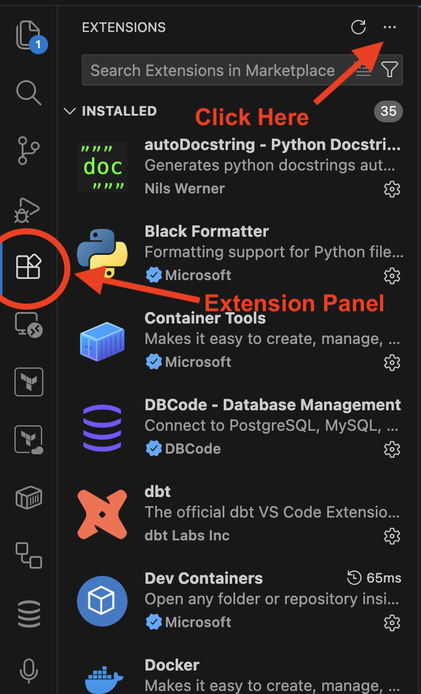
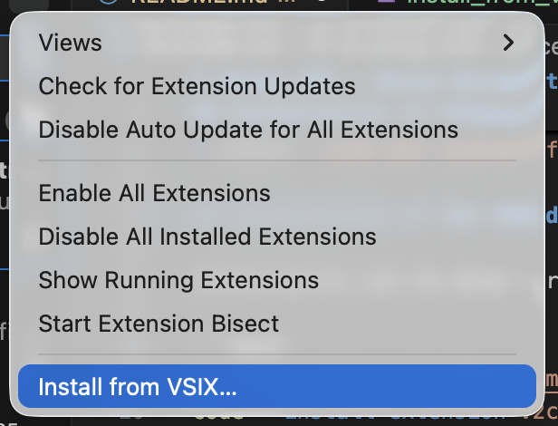
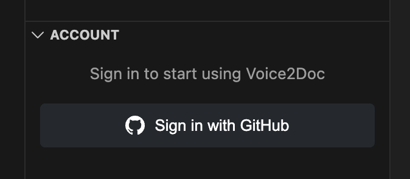
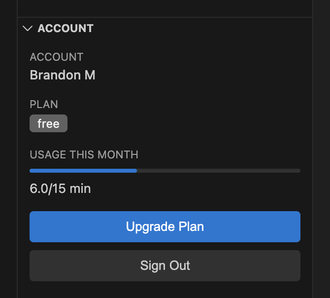
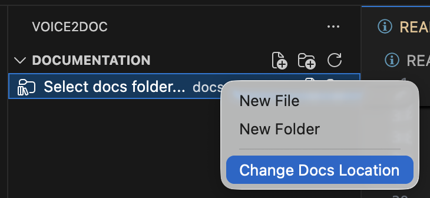
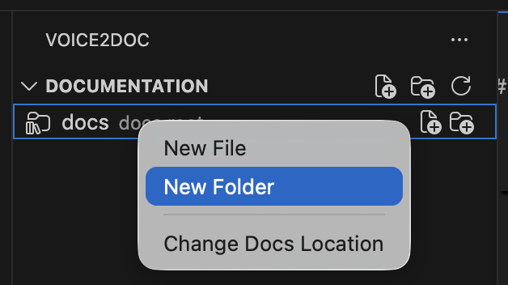
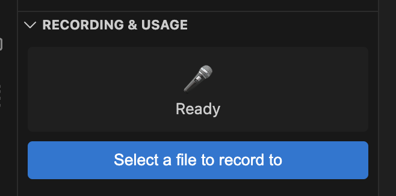
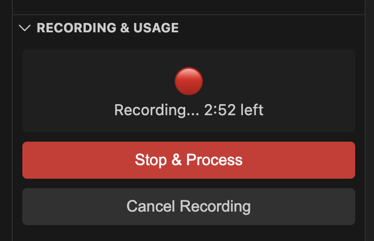
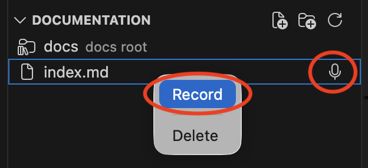

# Using V2D - Voice Documentation Tool

## Overview
Voice2Docs is a voice-to-documentation tool that allows you to create and update documentation by speaking naturally. The tool transcribes your speech and converts it into properly formatted markdown.

## Installation of FFmpeg

`ffmepg` is required to be installed on your system to do any audio recording. To install:

- Mac: `brew install ffmpeg`
- Windows: `winget install ffmpeg`
- Linux: `sudo apt install ffmpeg`

## Installation of the VSCode plugin

Installation can be done through the CLI. Clone the repo and install it:

```bash
git clone https://github.com/WxBDM/Voice2Docs-Issues.git v2c-test
code --install-extension v2c-test/voice2doc-0.1.0.vsix
```

To install with the UI:

1. Open any project in Visual Studio Code
2. Navigate to the extensions pane and click the 3 dots in the upper right corner (...)



3. Select the .vsix file in this repository



Note: A similar installation process can be followed with Cursor.

## Initial Setup

### Authentication
First, log in using your GitHub account. In the Accounts window of your Voice2Docs panel:

1. Select "Login with GitHub" and a new browser will open.
2. Sign in with your GitHub account




> **Important:** Username and password sign-in has not been tested. Use GitHub account authentication only for the time being.

Once logged in, the accounts section displays:
- Your name
- Current plan/tier
- Usage for this month
- Options to upgrade plan or sign out



> **Note:** Currently, there is no direct way to upgrade your plan through the interface. A plan is how I keep track of usage and prevent abuse/put features behind a paywall. If you need more usage, please reach out directly and I'll manually upgrade you to higher usage.

### Setting Up Documentation Location

The documentation folder should be auto-detected by finding the `docs` directory in the workspace.

If not detected, right-click and select "Change Docs Location" under the Documentation tab:



This will open a new window within the workspace. Select the documentation folder.

> Note: the application only supports Markdown files as of pre-release. Consideration for other file types (txt, etc) may be included in future releases.

### Creating New Files and Folders
To create a new file or folder for your documentation, hover over your documentation root
and 2 buttons will appear. Alternatively, right click on a folder:



---

## Recording Interface

### Method 1: General Recording
Under "Recording and Usage," you'll see a microphone with "Ready to Record" status and a countdown timer. 



When recording begins, the interface shows "Stop and Process" or "Cancel Recording" options:



> Important: there is a three-minute recording limit per session to prevent API abuse for free tiers. Paid tiers will have this cap raised.

#### Method 2: Document-Specific Recording
1. Navigate to the documentation roots section (contains all documents)
2. Hover over any document to reveal a microphone icon
3. Click the microphone icon to start recording immediately for that specific document
4. Alternatively, right-click and select "Record"



### Recording Process
When one of these buttons is clicked, the recording interface will automatically update to one of the images above with a countdown timer. Record what you want to document and click "stop & process" if you're happy with the recording. Otherwise, hit "cancel recording".

After a few moments, you'll see a diff pop-up appear in the editor. You can approve or deny the proposed changes (I'd recommend you approve it so you don't lose these changes).

Note that if you cancel a recording, it will not count towards your usage. However, denying a proposed change will count towards usage.

---

## Usage Limits and Notes

### Recording Limits
- There is currently a 3-minute limit per recording session to prevent abuse
- There is a 15-minute total talk limit per month. As part of testing, you can request this to increase if needed.
- Canceled recordings do not count toward usage
- Higher limits may be available in future versions
- Monthly limits can be increased upon request

### Technical Limitations
- The application is not context-aware - it doesn't know other documentation and codebase. Future iterations may include context awareness.
- It currently supports markdown files only. Future iterations may support other formats.

## Getting Help

### Bug Reports and Feature Requests
Open an [issue in GitHub](https://github.com/WxBDM/Voice2Docs-Issues/blob/main/README.md) for any bugs encountered or desired features.

For assistance or support issues, reach out directly for help.